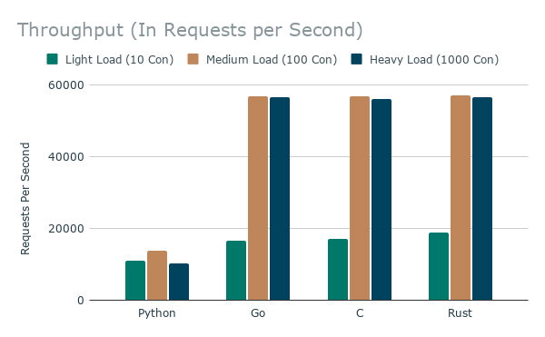
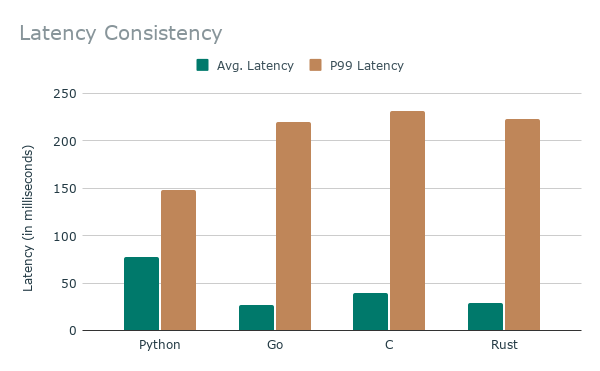

# SimpleHTTPServerProject
A Simple Project I did over the summer in order to learn more about HTTP server connections and handling.
# Multi-Language HTTP Server Benchmark
A high-concurrency performance comparison between HTTP servers written in **Python**, **Go**, **C**, and **Rust** running on a **Raspberry Pi 5**.

---

## Overarching Summary
This project evaluates the architectural efficiency, throughput capabilities, and latency profiles of four distinct programming environments under varying concurrency stress. 

By testing from a dedicated bare-metal client machine over a wired Gigabit Ethernet network, we eliminated external interference and isolated true language overhead. **Rust (Axum)** emerged as the absolute performance winner, offering the lowest pure tail latency ($580\mu\text{s}$) and highest peak throughput. **Go** and **C** tied closely behind, with all three compiled languages successfully saturating 99.4% of the physical hardware's network bandwidth. **Python (FastAPI)** hit a hard single-core CPU ceiling under heavy concurrency, leading to dropped packets and connection timeouts.

---

## Test Environment & Hardware Specs
To maintain a strict, scientifically controlled environment, the client and server were isolated on separate machines to prevent CPU/resource contention:

*   **Target Server Machine:** Raspberry Pi 5 (4GB RAM)
    *   **CPU:** Broadcom BCM2712 Quad-core ARM Cortex-A76 @ 2.4GHz
    *   **Cooling:** Argon Poly+ 5 Case + THRML 30-AC Active Cooler (maintaining a constant $45^{\circ}\text{C} - 50^{\circ}\text{C}$ core temperature).
    *   **Network Link:** Gigabit Ethernet (Cat 5e wired).
*   **Stress Client Machine:** High-performance Home PC running **Ubuntu via WSL2** (Cat 6 wired).
*   **Stress Testing Engine:** `wrk` (Asynchronous HTTP benchmarking tool).

---

## Benchmarking Methodology & Rules
1.  **Zero-Logging Enforcement:** Disk and console I/O create severe artificial performance bottlenecks. All access logging and stdout streams were stripped or set to `CRITICAL` levels.
2.  **Production-Optimized Compilations:** Code was compiled with aggressive compiler optimizations (`--release` for Rust, `-O3` for C) to evaluate actual deployment conditions.
3.  **Trivial Task Profile:** Every server performed the exact same task: listening on port `8080` and returning a lightweight `text/plain` payload containing `"Hello, World"`.
4.  **Load Grading Profiles:**
    *   **Light Load:** 4 threads, 10 concurrent connections (30-second duration).
    *   **Medium Load:** 4 threads, 100 concurrent connections (30-second duration).
    *   **Heavy Load:** 4 threads, 1,000 concurrent connections (30-second duration).

---

## 📈 Aggregated Empirical Data

### Throughput (Requests Per Second)

| Language | Light Load (10 Con) | Medium Load (100 Con) | Heavy Load (1000 Con) |
| :--- | :---: | :---: | :---: |
| **Python (FastAPI)** | 11,105.74 RPS | 13,762.15 RPS | 10,241.15 RPS *(603 Timeouts)* |
| **Go (StdLib)** | 16,616.74 RPS | 56,666.20 RPS | 56,517.59 RPS |
| **C (libmicrohttpd)**| 17,137.20 RPS | 56,851.35 RPS | 55,898.00 RPS |
| **Rust (Axum)** | 18,933.25 RPS | **56,959.75 RPS** | 56,465.33 RPS |



### Latency Profiles (Average vs. P99 Tail)

| Language | Light (Avg / P99) | Medium (Avg / P99) | Heavy (Avg / P99) |
| :--- | :---: | :---: | :---: |
| **Python (FastAPI)** | $716.32\mu\text{s} \ / \ 0.93\text{ms}$ | $7.37\text{ms} \ / \ 8.03\text{ms}$ | $77.72\text{ms} \ / \ 148.01\text{ms}$ |
| **Go (StdLib)** | $477.63\mu\text{s} \ / \ 673.00\mu\text{s}$ | $1.75\text{ms} \ / \ 2.48\text{ms}$ | $26.36\text{ms} \ / \ 220.15\text{ms}$ |
| **C (libmicrohttpd)**| $460.62\mu\text{s} \ / \ 635.00\mu\text{s}$ | $1.74\text{ms} \ / \ 2.04\text{ms}$ | $39.83\text{ms} \ / \ 231.65\text{ms}$ |
| **Rust (Axum)** | $417.32\mu\text{s} \ / \ 580.00\mu\text{s}$ | $1.74\text{ms} \ / \ 1.93\text{ms}$ | $28.63\text{ms} \ / \ 222.79\text{ms}$ |



---

## 🔍 Deep Technical Analysis

### 1. The Raw Efficiency Winner
Under **Light Load (10 Connections)**, we capture pure runtime and architectural overhead before physical network constraints apply. **Rust (Axum)** won the absolute speed test with a P99 tail latency of **$580\mu\text{s}$**. C closely trailed at $635\mu\text{s}$, and Go landed at $673\mu\text{s}$. Python came in last but put up an impressive sub-millisecond response time ($930\mu\text{s}$) due to the efficiency of Starlette beneath FastAPI.

### 2. Hitting the "Gigabit Wall"
Notice how Go, C, and Rust all abruptly plateau at **~56,500 Requests per second** on both medium and heavy loads. This flatline represents a physical hardware bottleneck rather than a software limitation. 
Mathematical proof:
$$\text{HTTP Text Packet Payload + Overhead} \approx 2.2 \text{ KB}$$
$$56,500 \text{ req/sec} \times 2.2 \text{ KB} = 124,300 \text{ KB/sec}$$
$$124,300 \text{ KB/sec} \times 8 = \mathbf{994.4 \text{ Mbps}}$$
The compiled servers successfully maxed out **99.4% of the Raspberry Pi 5’s physical 1 Gbps Ethernet card**. 

### 3. The Latency Illusion at 1,000 Connections
At 1,000 connections, Python's P99 latency ($148.01\text{ms}$) superficially appears better than Rust's ($222.79\text{ms}$). This is a classic benchmarking illusion. Because Rust, C, and Go were pulling 5.5x more data through the network interface than Python, they completely filled the Linux Kernel's network socket buffers. Requests were forced to wait in an OS-level queue. Python never ran fast enough to fill the network card, keeping its buffer short, but it buckled under the processing overhead, resulting in **603 timeout socket failures**.

---
## 🚀 Execution Commands (Client Side)
Run these commands from the external testing machine targeting the Pi's local address:

```bash
# Light Load
wrk -t4 -c10 -d30s --latency http://stressed-rulyns.local

# Medium Load
wrk -t4 -c100 -d30s --latency http://stressed-rulyns.local

# Heavy Load
wrk -t4 -c1000 -d30s --latency http://stressed-rulyns.local
```
